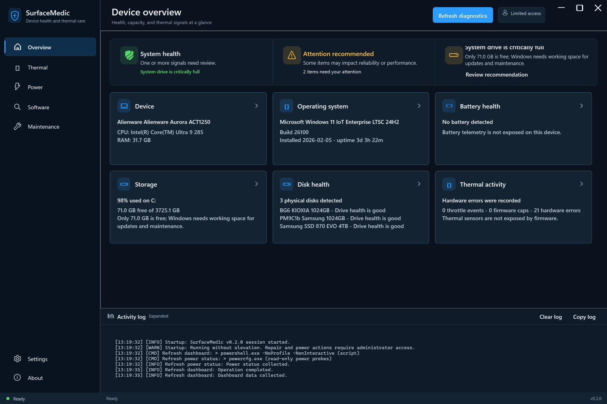
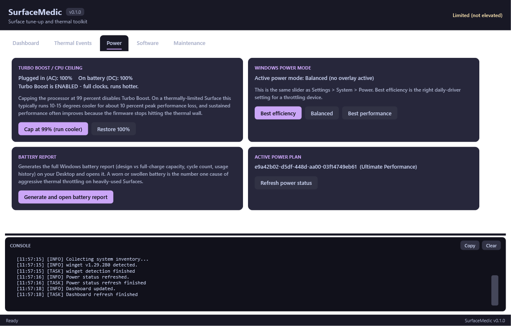
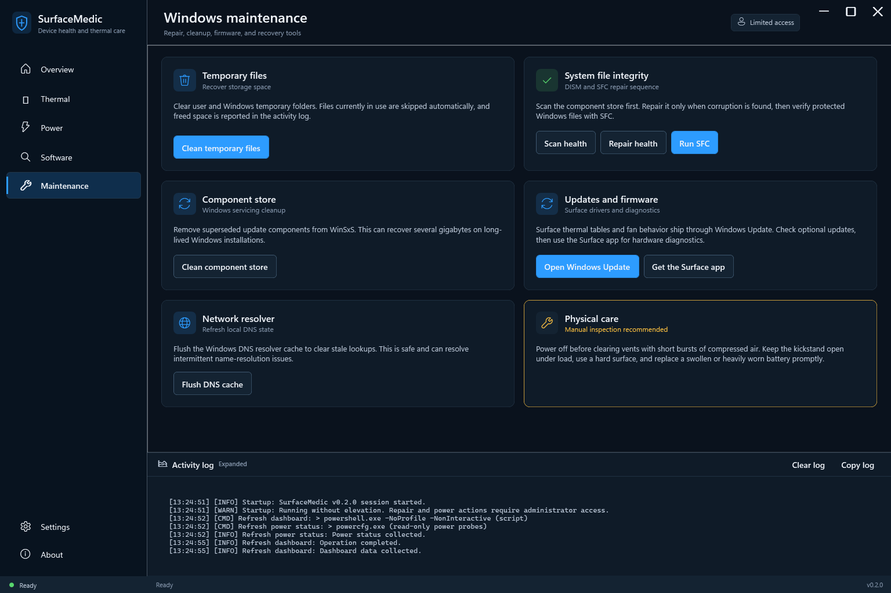

# SurfaceMedic


SurfaceMedic is a local Windows device-health, thermal, power, software, and repair workspace. It combines fast system diagnostics with carefully bounded maintenance actions, streams every operation into an in-app activity log, and stays responsive while long-running Windows tools complete.



## Highlights

- **Device overview** - PC, operating system, battery wear, storage pressure, physical-disk health, and a seven-day thermal snapshot with a clear attention summary.
- **Thermal history** - scans the System event log for thermal throttling, firmware speed caps, WHEA hardware errors, and temperature warnings across 7, 30, or 90 days; exports results to CSV.
- **Power controls** - reads AC/DC processor ceilings, toggles the 99% cool-running profile, switches Windows power modes, displays the active plan, and generates the native battery report.
- **Software maintenance** - searches, installs, and upgrades winget packages, with direct access to HWiNFO64, CrystalDiskInfo, LibreHardwareMonitor, and PowerToys.
- **Windows maintenance** - temporary-file cleanup, DISM health scan/repair, SFC, WinSxS cleanup, DNS reset, Windows Update, Surface diagnostics, and practical physical-care guidance.
- **Premium desktop shell** - .NET 9 WPF/MVVM, dark and light themes, visible keyboard focus, semantic health colors, purposeful empty/loading/error/success states, custom window chrome, persistent settings, toast feedback, and no separate console windows.
- **Local-first operation** - no accounts, telemetry, cloud dependency, or uploaded diagnostics. Session and crash logs stay under `%LOCALAPPDATA%\SurfaceMedic\logs`.



## Install

Download `SurfaceMedic.exe` from the latest GitHub release and run it. The self-contained x64 build includes the required .NET runtime and requests administrator access because power and repair actions need elevation.

The application remains useful with limited access if elevation is unavailable; privileged actions will report that administrator access is required instead of failing silently.

## Build from source

Requirements: Windows 10/11 and the .NET 9 SDK.

```powershell
dotnet build SurfaceMedic.sln -c Release
dotnet run --project src\SurfaceMedic.App\SurfaceMedic.App.csproj -c Release
```

Create the self-contained single-file executable:

```powershell
dotnet publish src\SurfaceMedic.App\SurfaceMedic.App.csproj -c Release -r win-x64 --self-contained true -p:PublishSingleFile=true -p:IncludeNativeLibrariesForSelfExtract=true
```

## Portable PowerShell edition

`SurfaceMedic.ps1` remains available for systems where copying one script is preferable to an executable:

```powershell
powershell -NoProfile -ExecutionPolicy Bypass -File SurfaceMedic.ps1
```

The portable edition supports Windows PowerShell 5.1 and PowerShell 7+, self-elevates, runs its work in a runspace pool, and preserves the original dashboard, thermal, power, winget, and maintenance workflows.



## Verification

The repository includes a dependency-free unit harness for winget parsing and health thresholds, a read-only live adapter check, and a non-activating WPF smoke mode that renders every view in both themes and refreshes the screenshots.

```powershell
dotnet run --project tests\SurfaceMedic.Tests\SurfaceMedic.Tests.csproj -c Release
dotnet run --project tests\SurfaceMedic.Tests\SurfaceMedic.Tests.csproj -c Release -- --live
dotnet run --project src\SurfaceMedic.App\SurfaceMedic.App.csproj -c Release -- --smoke
powershell -NoProfile -ExecutionPolicy Bypass -File SurfaceMedic.ps1 -Smoke
```

`--smoke` positions the WPF window offscreen, disables taskbar presence and activation, captures the UI, and exits. It does not steal focus or run destructive maintenance actions.

## Operational notes

- The 99% processor ceiling is applied to AC and battery values for the active plan. Restoring 100% re-enables Turbo Boost.
- Windows power-mode overlays are not exposed on every desktop power model. SurfaceMedic falls back to Balanced without treating that optional probe as a repair failure.
- Battery and ACPI thermal-zone telemetry depends on firmware support. Missing sensors are presented as unavailable, not healthy.
- Surface thermal tables and fan behavior arrive through Windows Update; optional firmware updates matter on devices that throttle.
- Undervolting is intentionally absent because current Surface firmware locks voltage controls.

## License

MIT
